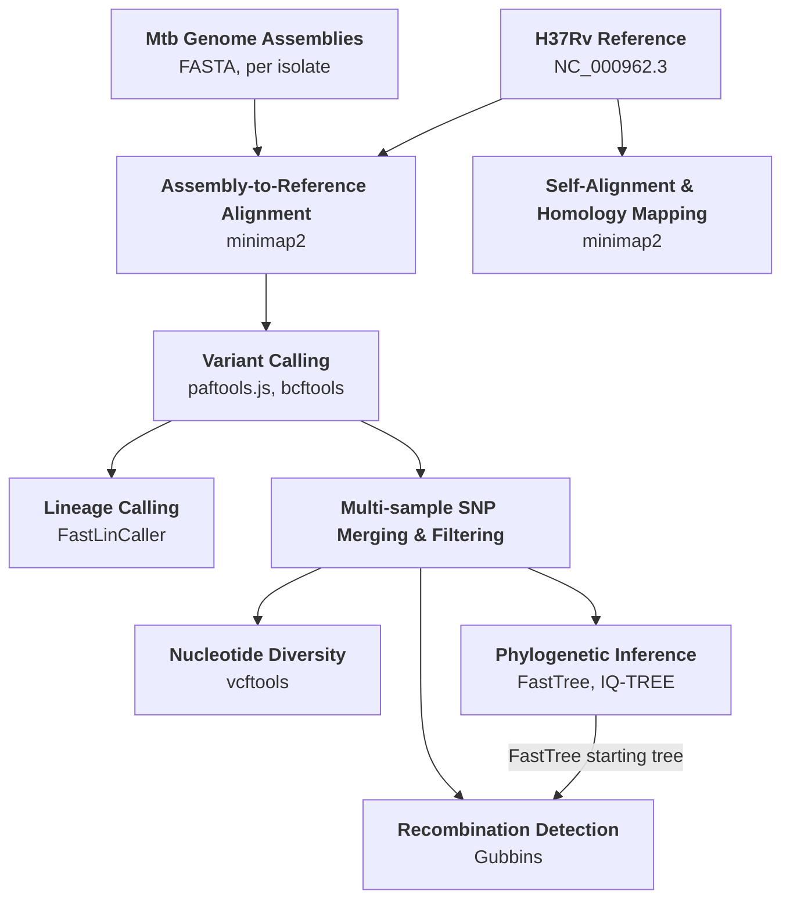

# Core Whole-Genome Analysis Pipeline (Mtb-WGA)

## Overview

This directory contains `Mtb.WGA.Core.V3.smk`, the core whole-genome analysis (WGA) Snakemake pipeline that underlies the main analyses in the manuscript. The pipeline takes complete *Mtb* genome assemblies as input, aligns them to the H37Rv reference genome, and produces a multi-sample SNV callset along with filtered FASTA alignments, phylogenetic trees, windowed nucleotide diversity estimates, and Gubbins-based recombination predictions.

The pipeline was run on two datasets:
- **Mtb151CI** — 151 complete hybrid assemblies (the primary dataset)
- **TBP-22-LR** — 22 PacBio HiFi assemblies generated for gene conversion validation

See [`docs/pipeline_stages.md`](docs/pipeline_stages.md) for a detailed breakdown of each processing stage. The exact commands used to run the pipeline on each dataset are documented in [`docs/run_commands.md`](docs/run_commands.md).

## Inputs

| Input | Description |
|---|---|
| `output_dir` | Target directory where all pipeline results will be written |
| `--configfile` | `Mtb-WGA.config.json` — paths to reference files (H37Rv FASTA, GFF, GenBank) and other tool settings |
| `inputSampleData_TSV` | Sample sheet TSV with one row per isolate: `SampleID` and path to the complete assembly FASTA |

## Pipeline Stages

1. **H37Rv homology mapping** — minimap2 self-alignment of the H37Rv reference ([NC_000962.3](https://www.ncbi.nlm.nih.gov/nuccore/448814763)) against itself (k19/w19 params) to generate a map of repetitive/low-complexity (RLC) and paralogous low-complexity (PLC) regions used as masks for downstream SNV filtering
2. **Assembly-to-reference alignment** — each complete assembly is aligned to H37Rv using minimap2 (asm10 mode, optimized for highly similar sequences)
3. **Per-sample variant calling** — variants called from alignments using paftools.js (from PAF) and bcftools mpileup (from BAM); indels >15 bp removed
4. **MTBC lineage calling** — branches off per-sample variant calls; FastLinCaller assigns *Mtb* lineage per isolate
5. **Multi-sample SNP merging & filtering** — per-sample VCFs unified to a common position set, merged into a joint callset, and filtered by ambiguity threshold (≤10% missing data)
6. **Phylogenetic inference** — FastTree (GTR) for a rapid tree used as the Gubbins starting tree; IQ-TREE (GTR+ASC, 10,000 ultrafast bootstraps) for the final published tree
7. **Nucleotide diversity** — windowed nucleotide diversity (π) calculated with vcftools across 1,000 bp windows
8. **Recombination detection** — Gubbins v3.2.1 (extensive search, min-window=25, max-window=1,000, min-snps=4) run on a pseudo-full-genome MSA constructed by inserting per-sample SNVs into H37Rv, using the FastTree output as the starting tree

## Outputs

| Output | Description |
|---|---|
| Per-sample alignment & variant calls | BAM, PAF, and VCF files per isolate from assembly-to-reference alignment |
| MTBC lineage calls | Per-sample lineage assignment TSV (FastLinCaller) |
| Multi-sample SNP callset | Joint VCF (and derived formats: compressed VCF, FASTA alignment) of all SNVs across the dataset |
| Phylogenetic tree | Maximum-likelihood tree (IQ-TREE, GTR+ASC) for the input isolate set |
| Nucleotide diversity | Per-window π estimates across the H37Rv reference genome |
| Recombination predictions | Gubbins output including a recombination predictions GFF/BED, per-branch statistics CSV, and a node-labelled phylogeny; these predictions are the basis for identifying putative gene conversion events, as Gubbins flags genomic intervals where a lineage has accumulated SNVs at a rate far exceeding the background substitution rate of the population |

## Pipeline Overview

```
  Mtb Genome Assemblies            H37Rv Reference (NC_000962.3)
  (FASTA, per isolate)             │
          │                        ▼
          │               H37Rv Self-Alignment &
          │               Homology Mapping (minimap2)
          │
          ▼
  Assembly-to-Reference Alignment (minimap2)
          │
          ▼
  Variant Calling (paftools.js, bcftools)
          │
          ├──────────────────────────────┐
          │                             │
          ▼                             ▼
  Lineage Calling              Multi-sample SNP
  (FastLinCaller)              Merging & Filtering
                                        │
                    ┌───────────────────┼───────────────────┐
                    │                   │                   │
                    ▼                   ▼                   ▼
          Phylogenetic            Nucleotide          Recombination
          Inference               Diversity           Detection
          (FastTree → IQ-TREE)    (vcftools)          (Gubbins)
                    │                                       ▲
                    └───────── FastTree starting tree ──────┘
```



## Key Tools

| Tool | Version | Purpose |
|---|---|---|
| minimap2 | — | Assembly-to-reference alignment (asm10); homology mapping (asm20, k19/w19) |
| paftools.js | — | Variant calling from PAF alignments |
| bcftools | — | mpileup variant calling, VCF filtering and merging |
| bedtools | — | Region-based VCF filtering (RLC, PLC, low mappability masks) |
| vcftools | — | Windowed nucleotide diversity (π) |
| vcf2phylip | — | VCF → FASTA alignment conversion |
| FastTree | — | Rapid GTR maximum-likelihood phylogeny |
| IQ-TREE | — | GTR+ASC phylogeny with ultrafast bootstrap |
| snp-sites | — | Extract SNP-only sites FASTA for IQ-TREE |
| Gubbins | v3.2.1 | Recombination detection on whole-genome MSA |
| FastLinCaller | — | *Mtb* lineage calling |
| bcftools consensus | — | Per-sample pseudo-whole-genome FASTA for MSA construction |

> Exact versions for most tools are specified in the Conda environment files referenced within the `.smk` pipeline.

## Usage

### Dry run (check pipeline)

```bash
SMK_RepoDir="/path/to/Snakemake_Workflows/2_CoreAnalysis_SMK"
targetOutput_Dir="/path/to/output/directory"
inputConfigFile="${SMK_RepoDir}/Mtb-WGA.config.json"
inputSampleData_TSV="/path/to/sample_sheet.tsv"

mkdir -p ${targetOutput_Dir}

snakemake -s Mtb.WGA.Core.V3.smk \
    --config output_dir=${targetOutput_Dir} inputSampleData_TSV=${inputSampleData_TSV} \
    --configfile ${inputConfigFile} \
    -np
```

### Local execution

```bash
snakemake -s Mtb.WGA.Core.V3.smk \
    --config output_dir=${targetOutput_Dir} inputSampleData_TSV=${inputSampleData_TSV} \
    --configfile ${inputConfigFile} \
    -p --cores 4 --rerun-incomplete
```

### HMS O2 Slurm cluster submission

```bash
input_ClusterConfig="${SMK_RepoDir}/Mtb-WGA.clusterConfig.json"

mkdir -p ${targetOutput_Dir}/O2logs/cluster/

time snakemake -s Mtb.WGA.Core.V3.smk \
    --config output_dir=${targetOutput_Dir} inputSampleData_TSV=${inputSampleData_TSV} \
    --configfile ${inputConfigFile} \
    -p --use-conda -j 500 \
    --cluster-config ${input_ClusterConfig} \
    --cluster "sbatch -p {cluster.p} -n {cluster.n} -t {cluster.t} --mem {cluster.mem} \
               -o ${targetOutput_Dir}/O2logs/cluster/{cluster.o} \
               -e ${targetOutput_Dir}/O2logs/cluster/{cluster.e}" \
    --latency-wait 45 -k --rerun-incomplete
```

Key flags:
- `-j 500` — allow up to 500 concurrent Slurm jobs
- `--use-conda` — activate per-rule Conda environments
- `--latency-wait 45` — wait 45 seconds for output files after job completion
- `-k` — continue running independent rules if one job fails
- `--rerun-incomplete` — rerun any jobs whose output files are incomplete

## Input Manifests

The following sample sheets were used as input for each dataset:

- **Mtb151CI** — [231121.MtbSetV3.151CI.HybridAndSRAsm.FAPATHs.V1.tsv](../../Data/231121.InputAsmTSVs.MtbSetV3.151CI/231121.MtbSetV3.151CI.HybridAndSRAsm.FAPATHs.V1.tsv)
- **TBP-22-LR** — [250801.TBP22.22CI.GCEVerfIsolates.Asm_LR_SR.InputPATHs.tsv](../../Data/TBP22.22CI.GCEVerfIsolates.Metadata/250801.TBP22.22CI.GCEVerfIsolates.Asm_LR_SR.InputPATHs.tsv)
